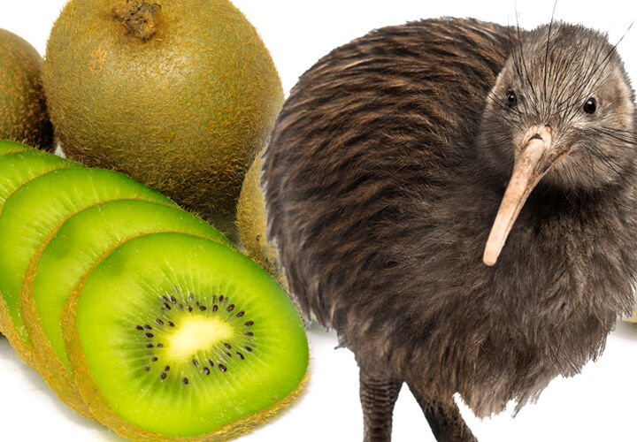

 

  

---
---
# Prewiew

---
---

 # ✨ME✨
 

---
---

 # 📝STUDYING📝
 * [`C`](https://github.com/woooooosangyi/C-language.git)
 * [`Data Structure`](https://github.com/sangyiwoo/Data-Structure.git)
 * [`Algorithm`](https://github.com/sangyiwoo/Algorithm.git)
 * [`Java`](https://github.com/sangyiwoo/Java.git)
 * [`Python`](https://github.com/sangyiwoo/Python.git)

